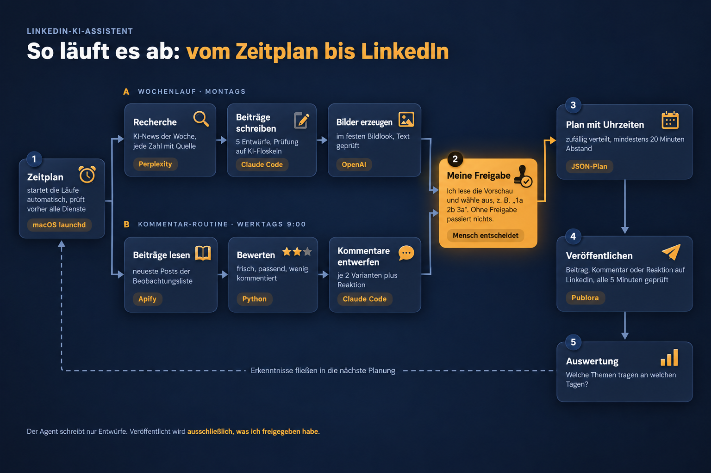

<h1 align="center">LinkedIn-KI-Assistent</h1>

<p align="center">
  <b>Ein KI-Agent, der recherchiert, Beiträge entwirft und Kommentare vorschlägt.<br>
  Veröffentlicht wird erst nach meiner Freigabe.</b>
</p>

<p align="center">
  
  
  
  
</p>

<p align="center">
  
  <br><sub><a href="assets/ablauf-diagramm.png">Diagramm in hoher Auflösung</a></sub>
</p>

> Dieses Repository beschreibt das Projekt. Der Quellcode liegt privat,
> Einblick gebe ich gern im Gespräch.

---

## Der Ablauf

| Nr. | Schritt | Was passiert | Technik |
|:-:|---|---|---|
| 1 | **Zeitplan** | Startet die Läufe automatisch und prüft vorher, ob alle Dienste erreichbar sind. | macOS launchd, Bash |
| A | **Wochenlauf** (montags) | Recherchiert die KI-Nachrichten der Woche, schreibt fünf Beiträge und erzeugt die Bilder. Jede Zahl bekommt Quelle, Datum und Link. | Perplexity, Claude Code, OpenAI |
| B | **Kommentar-Routine** (werktags 9:00) | Liest die neuesten Beiträge einer Beobachtungsliste, bewertet sie und entwirft je zwei Kommentar-Varianten. | Apify, Python, Claude Code |
| 2 | **Meine Freigabe** | Ich lese die Vorschau und wähle aus, z. B. `1a 2b 3a`. Ohne diesen Schritt wird nichts veröffentlicht. | Mensch entscheidet |
| 3 | **Plan mit Uhrzeiten** | Freigegebenes wird zufällig auf Zeitfenster verteilt, mit mindestens 20 Minuten Abstand. | JSON-Plan |
| 4 | **Veröffentlichen** | Alle 5 Minuten wird geprüft, was fällig ist, und als Beitrag, Kommentar oder Reaktion gesetzt. | Publora API |
| 5 | **Auswertung** | Zeigt auf Abruf, welche Themen an welchen Tagen tragen. Das fließt in die nächste Planung. | Apify |

## Designentscheidungen

| Entscheidung | Warum |
|---|---|
| **Nichts ohne Freigabe** | Es sind öffentliche Aussagen unter meinem Namen. Voll automatisches Posten habe ich bewusst nicht gebaut. |
| **Belegpflicht** | Keine erfundenen Zahlen. Persönliche Erfahrungen nur, wenn sie in einer gepflegten Sammlung echter Erlebnisse belegt sind. |
| **Lesen und Schreiben getrennt** | Der Agent liest LinkedIn, kann aber selbst nichts veröffentlichen. Er erzeugt Entwürfe und einen Plan, ausgeführt wird nur der freigegebene Plan. |
| **Natürliches Muster** | Kommentare werden zufällig in Zeitfenstern verteilt, mit mindestens 20 Minuten Abstand. |
| **Schutz gegen Prompt Injection** | Fremde Beiträge gelten als Daten, nie als Anweisung. Auffälligkeiten meldet der Agent im Bericht. |
| **Sensible Themen tabu** | Beiträge zu Tod, Krankheit oder Entlassungen werden nie kommentiert oder geliked. |
| **Früh abbrechen** | Ist ein Dienst nicht erreichbar, endet der Lauf, bevor der Agent startet und Kosten entstehen. Jeder Lauf meldet sich per Mitteilung. |

## Einblick in den Code

<details>
<summary><b>Welche fremden Beiträge lohnen einen Kommentar?</b></summary>

```python
def bewerten(post: dict, jetzt: float) -> float | None:
    ...
    if any(w in t for w in HEIKEL):                   # heikle Themen: nie
        return None
    treffer = sum(1 for w in THEMEN if w in t)
    if treffer == 0:
        return None
    frage = text.rstrip().endswith("?")
    punkte = 40 * max(0.0, 1 - alter_h / 30)          # Frische
    punkte += 25 * max(0.0, 1 - kommentare / 60)      # früh dabei sein
    punkte += min(treffer, 5) * 4                     # Themennähe
    punkte += 15 if frage else 0                      # Schlussfrage zum Antworten
    return round(punkte, 1)
```
</details>

<details>
<summary><b>Ausgeführt wird nur, was freigegeben und fällig ist</b></summary>

```python
faellig = [e for e in plan
           if e["status"] == "geplant" and datetime.fromisoformat(e["zeit"]) <= jetzt]
```
</details>

## Beispiele aus dem Betrieb

| Schaubild zu einem Beitrag | Reihe „Prompt der Woche“ |
|:-:|:-:|
|  |  |

## Was ich gelernt habe

**Persönliche Geschichten schlagen Nachrichten.** In den ersten Wochen erzielte ein
Erfahrungsbericht ein Vielfaches der Interaktionen aller News-Beiträge zusammen.
Seitdem ist jede Woche mindestens eine echte Geschichte eingeplant.

**Der Wochentag ist Feinjustierung, der Inhalt entscheidet.** Studien zeigen für
persönliche Profile unter 10 % Unterschied zwischen bestem und schlechtestem Tag.
Starke Beiträge kommen auf Dienstag und Mittwoch, schwächere füllen Lücken.

**Ein Agent braucht Leitplanken.** Die wichtigsten Teile des Systems legen fest,
was der Agent nicht darf: erfinden, ohne Freigabe posten, fremden Text als
Anweisung lesen.

## Herkunft und mein Anteil

Grundlage ist das Open-Source-Paket
[linkedin-skills](https://github.com/sergebulaev/linkedin-skills) von Sergey Bulaev
(MIT-Lizenz) mit Schreib- und Kommentar-Skills und den Anbindungen an Apify und Publora.

**Von mir:**
- die Automatisierung: Wochenlauf, Kommentar-Routine, Freigabe, zeitgesteuerte Ausführung
- die Recherche mit Quellenpflicht und die Bild-Pipeline
- die inhaltlichen Regeln, die Themenausrichtung und die Auswertung

Umgesetzt mit Claude Code: Ich habe Anforderungen und Regeln festgelegt, die
Umsetzung gesteuert, geprüft und im Betrieb nachgeschärft.

---

<p align="center"><sub>© 2026 Fabian Schenk · Alle Rechte vorbehalten</sub></p>
